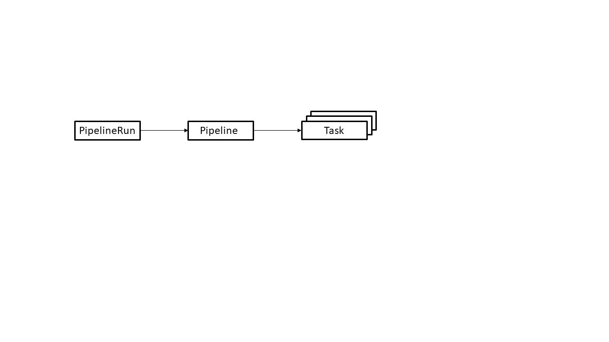

## Knative Deployment using Tekton Pipelines

Tekton is an open source project to configure and run CI/CD pipelines within a Kubernetes cluster.


## Introduction

In this tutorial you'll learn
* what are the basic concepts used by Tekton pipelines
* how to create a pipeline to build and deploy a Knative application
* how to run the pipeline, check its status and troubleshoot problems


## Prerequisites

Before you start the tutorial you must set up a Kubernetes environment with Knative and Tekton installed.

* [Install the CLIs to manage a cluster](https://cloud.ibm.com/docs/containers?topic=containers-cs_cli_install#cs_cli_install_steps)

* [Create a standard Kubernetes cluster in IBM Kubernetes Service](https://cloud.ibm.com/docs/containers?topic=containers-clusters#clusters_ui_standard)

    **Note**:  The managed Knative add-on requires Kubernetes version 1.16 or later.

* [Create a private container registry in IBM Container Service](https://cloud.ibm.com/docs/services/Registry?topic=registry-registry_setup_cli_namespace#registry_setup_cli_namespace)

* [Install Knative in your cluster using the managed Knative add-on](https://cloud.ibm.com/docs/containers?topic=containers-knative_tutorial#knative_setup)

    **Note**:  The managed Knative add-on also installs Tekton.

## Estimated time

1 hour


## Steps


### 1. Tekton pipeline concepts

Tekton provides a set of extensions to Kubernetes, in the form of [Custom Resources](https://kubernetes.io/docs/concepts/extend-kubernetes/api-extension/custom-resources/), for defining pipelines.
The following diagram shows the resources used in this tutorial.  The arrows depict references from one resource to another resource.



The resources are used as follows.

* A **PipelineResource** defines an object that is an input (such as a git repository) or an output (such as a docker image) of the pipeline.
* A **PipelineRun** defines an execution of a pipeline.  It references the **Pipeline** to run and the **PipelineResources** to use as inputs and outputs.
* A **Pipeline** defines the set of **Tasks** that compose a pipeline.
* A **Task** defines a set of build steps such as compiling code, running tests, and building and deploying images.

We will go into more detail about each resource during the walkthrough of the example.


### 2. Sample pipeline

Let's create a simple pipeline that

* builds a Docker image from source files and pushes it to your private container registry
* deploys the image as a Knative service in your Kubernetes cluster

You should clone this project to your workstation since you will need to edit some of the yaml files before applying them to your cluster.

```
git clone https://github.com/IBM/tekton-tutorial
```

We will work from the bottom-up, i.e. first we will define the Task resources needed to build and deploy the image,
then we'll define the Pipeline resource that references the tasks,
and finally we'll create the PipelineRun and PipelineResource resources needed to run the pipeline.


#### Create a task to build an image and push it to a container registry

Below is a Tekton task that builds a docker image and pushes it to a container registry.
You can find this yaml file at [tekton/tasks/source-to-image.yaml](tekton/tasks/source-to-image.yaml).

```
apiVersion: tekton.dev/v1alpha1
kind: Task
metadata:
  name: source-to-image
spec:
  inputs:
    resources:
      - name: git-source
        type: git
    params:
      - name: pathToContext
        description: The path to the build context, used by Kaniko - within the workspace
        default: .
      - name: pathToDockerFile
        description: The path to the dockerfile to build (relative to the context)
        default: Dockerfile
      - name: imageUrl
        description: Url of image repository
      - name: imageTag
        description: Tag to apply to the built image
        default: "latest"
  steps:
    - name: build-and-push
      image: gcr.io/kaniko-project/executor
      command:
        - /kaniko/executor
      args:
        - --dockerfile=$(inputs.params.pathToDockerFile)
        - --destination=$(inputs.params.imageUrl):$(inputs.params.imageTag)
        - --context=/workspace/git-source/$(inputs.params.pathToContext)
```

A task can have one or more steps.  Each step defines an image to run to perform the function of the step.
This task has one step that uses the [kaniko](https://github.com/GoogleContainerTools/kaniko) project to build a docker image from source and push it to a registry.

The task requires an input resource of type `git` that defines where the source is located.
The `git` source is cloned to a local volume at path `/workspace/git-source` where `git-source` comes from the name we gave to the resource.
Note that a resource is simply an abstract argument to the task.
We'll see later how it becomes bound to a PipelineResources which defines the actual resource to be used.
This makes the task reusable with different git repositories.

A task also can have input parameters.  Parameters help to make a Task more reusable.
This task accepts the following parameters:
* a path to the Docker build context inside the git source
* a path to the Dockerfile inside the build context
* the URL of the image repository where the image should be stored
* an image tag to apply to the built image

You may be wondering about how the task authenticates to the image repository for permission to push the image.
This will be covered later on in the tutorial.

Apply the file to your cluster to create the task.

```
kubectl apply -f tekton/tasks/source-to-image.yaml
```


### 3. Create a task to deploy an image to a Kubernetes cluster

Below is a Tekton task that deploys a docker image to a Kubernetes cluster.
You can find this yaml file at [tekton/tasks/deploy-using-kubectl.yaml](tekton/tasks/deploy-using-kubectl.yaml).

```
apiVersion: tekton.dev/v1alpha1
kind: Task
metadata:
  name: deploy-using-kubectl
spec:
  inputs:
    resources:
      - name: git-source
        type: git
    params:
      - name: pathToYamlFile
        description: The path to the yaml file to deploy within the git source
      - name: imageUrl
        description: Url of image repository
      - name: imageTag
        description: Tag of the images to be used.
        default: "latest"
  steps:
    - name: update-yaml
      image: alpine
      command: ["sed"]
      args:
        - "-i"
        - "-e"
        - "s;__IMAGE__;$(inputs.params.imageUrl):$(inputs.params.imageTag);g"
        - "/workspace/git-source/$(inputs.params.pathToYamlFile)"
    - name: run-kubectl
      image: lachlanevenson/k8s-kubectl
      command: ["kubectl"]
      args:
        - "apply"
        - "-f"
        - "/workspace/git-source/$(inputs.params.pathToYamlFile)"
```

This task has two steps.

1. The first step runs `sed` in an Alpine Linux container to update the yaml file used for deployment with the image that was built by the source-to-image task.
The step requires the yaml file to have a character string `__IMAGE__` at the point where this update needs to occur.

2. The second step runs `kubectl` using Lachlan Evenson's popular `k8s-kubectl` container image to apply the yaml file to the same cluster where the pipeline is running.

As was the case in the source-to-image task, this task makes use of an input PipelineResource and parameters in order to make the task as reusable as possible.

You may be wondering about how the task authenticates to the cluster for permission to apply the resource(s) in the yaml file.
This will be covered later on in the tutorial.

Apply the file to your cluster to create the task.

```
kubectl apply -f tekton/tasks/deploy-using-kubectl.yaml
```


### 4. Create a pipeline

Below is a Tekton pipeline that runs the two tasks we defined above.
You can find this yaml file at [tekton/pipeline/build-and-deploy-pipeline.yaml](tekton/pipeline/build-and-deploy-pipeline.yaml).

```
apiVersion: tekton.dev/v1alpha1
kind: Pipeline
metadata:
  name: build-and-deploy-pipeline
spec:
  resources:
    - name: git-source
      type: git
  params:
    - name: pathToContext
      description: The path to the build context, used by Kaniko - within the workspace
      default: src
    - name: pathToYamlFile
      description: The path to the yaml file to deploy within the git source
    - name: imageUrl
      description: Url of image repository
    - name: imageTag
      description: Tag to apply to the built image
  tasks:
  - name: source-to-image
    taskRef:
      name: source-to-image
    params:
      - name: pathToContext
        value: "$(params.pathToContext)"
      - name: imageUrl
        value: "$(params.imageUrl)"
      - name: imageTag
        value: "$(params.imageTag)"
    resources:
      inputs:
        - name: git-source
          resource: git-source
  - name: deploy-to-cluster
    taskRef:
      name: deploy-using-kubectl
    runAfter:
      - source-to-image
    params:
      - name: pathToYamlFile
        value:  "$(params.pathToYamlFile)"
      - name: imageUrl
        value: "$(params.imageUrl)"
      - name: imageTag
        value: "$(params.imageTag)"
    resources:
      inputs:
        - name: git-source
          resource: git-source
```

A Pipeline resource lists the tasks to run and provides the input and output resources and input parameters required by each task.
All resources must be exposed as inputs or outputs of the pipeline;  the pipeline cannot bind one to an actual PipelineResource.
However you can choose whether to expose a task's input parameter as a pipeline input parameter, set the value directly, or let the value
default inside the task (if it's an optional parameter).  For example this pipeline exposes the `pathToContext` parameter from the
source-to-image task but does not expose the `pathToDockerFile` parameter and allows it to default inside the task.

Dependencies between tasks can be expressed by using the `runAfter` key.
It specifies that the task must run after the given list of one of tasks has completed.
In this example, this pipeline specifies that the `deploy-using-kubectl` task must run after the `source-to-image` task.
Tekton will order to the execution of the tasks to satisfy this dependency.

Dependencies between tasks also can be expressed by using the `from` key which isn't used in this tutorial
but which you can [read about in the official Tekton documentation](https://github.com/tektoncd/pipeline/blob/master/docs/pipelines.md#from).

Apply the file to your cluster to create the pipeline.

```
kubectl apply -f tekton/pipeline/build-and-deploy-pipeline.yaml
```


### 5. Create PipelineRun and PipelineResources

We've defined reusable Pipeline and Task resources for building and deploying an image.
It is now time to look at how one runs the pipeline with an actual input resource and parameters.

Below is a Tekton PipelineRun resource that runs the pipeline we defined above.
You can find this yaml file at [tekton/run/picalc-pipeline-run.yaml](tekton/run/picalc-pipeline-run.yaml).

```
apiVersion: tekton.dev/v1alpha1
kind: PipelineRun
metadata:
  generateName: picalc-pr-
spec:
  pipelineRef:
    name: build-and-deploy-pipeline
  resources:
    - name: git-source
      resourceRef:
        name: picalc-git
  params:
    - name: pathToYamlFile
      value: "knative/picalc.yaml"
    - name: imageUrl
      value: <REGISTRY>/<NAMESPACE>/picalc
    - name: imageTag
      value: "1.0"
  serviceAccountName: pipeline-account
```

Although this file is small there is a lot going on here.  Let's break it down from top to bottom:

* The PipelineRun does not have a fixed name.  It uses `generateName` to generate a name each time it is created.
This is because a particular PipelineRun resource executes the pipeline only once.  If you want to run the pipeline again,
you cannot modify an existing PipelineRun resource to request it to re-run -- you must create a new PipelineRun resource.
While you could use `name` to assign a unique name to your PipelineRun each time you create one, it is much easier to use `generateName`.

* The Pipeline resource is identified under the `pipelineRef` key.

* The git resource required by the pipeline is bound to specific PipelineResources named `picalc-git`.
We will define it in a moment.

* Parameters exposed by the pipeline are set to specific values.

* A service account named `pipeline-account` is specified to provide the credentials needed for the pipeline to run successfully.
We will define this service account in the next part of the tutorial.

You must edit this file to substitute the values of `<REGISTRY>` and `<NAMESPACE>` with the information for your private container registry.

* To find the value for `<REGISTRY>`, enter the command `ibmcloud cr region`.
* To find the value of `<NAMESPACE>`, enter the command `ibmcloud cr namespace-list`.

Below is the Tekton PipelineResource for `picalc-git` which defines the git source.
You can find this yaml file at [tekton/resources/picalc-git.yaml](tekton/resources/picalc-git.yaml).

```
apiVersion: tekton.dev/v1alpha1
kind: PipelineResource
metadata:
  name: picalc-git
spec:
  type: git
  params:
    - name: revision
      value: master
    - name: url
      value: https://github.com/IBM/tekton-tutorial
```

The source code for this example is a [go program that calculates an approximation of pi](src/picalc.go).
The source includes a [Dockerfile](src/Dockerfile) which runs tests, compiles the code, and builds an image for execution.

You can apply the PipelineResource file to your cluster now.
Do not apply the PipelineRun file yet because we still need to define the service account for it.

```
kubectl apply -f tekton/resources/picalc-git.yaml
```


### 6. Define a service account

The last step before running the pipeline is to set up a service account so that it can access protected resources.
The service account ties together a couple of secrets containing credentials for authentication
along with RBAC-related resources for permission to create and modify certain Kubernetes resources.

First you need to enable programmatic access to your private container registry by creating
an IBM Cloud Identity and Access Management (IAM) API key.
The process for creating a user API key is described [here](https://cloud.ibm.com/docs/services/Registry?topic=registry-registry_access#registry_access).

After you have the API key, you can create the following secret.

```
kubectl create secret generic ibm-cr-push-secret --type="kubernetes.io/basic-auth" --from-literal=username=iamapikey --from-literal=password=<APIKEY>
kubectl annotate secret ibm-cr-push-secret tekton.dev/docker-0=<REGISTRY>
```

where

* `<APIKEY>` is either the API key that you created
* `<REGISTRY>` is the URL of your container registry, such as `us.icr.io`

Now you can create the service account using the following yaml.
You can find this yaml file at [tekton/pipeline-account.yaml](tekton/pipeline-account.yaml).

```
apiVersion: v1
kind: ServiceAccount
metadata:
  name: pipeline-account
secrets:
- name: ibm-cr-push-secret

---

apiVersion: v1
kind: Secret
metadata:
  name: kube-api-secret
  annotations:
    kubernetes.io/service-account.name: pipeline-account
type: kubernetes.io/service-account-token

---

kind: Role
apiVersion: rbac.authorization.k8s.io/v1
metadata:
  name: pipeline-role
rules:
- apiGroups: ["serving.knative.dev"]
  resources: ["services"]
  verbs: ["get", "create", "update", "patch"]

---

apiVersion: rbac.authorization.k8s.io/v1
kind: RoleBinding
metadata:
  name: pipeline-role-binding
roleRef:
  apiGroup: rbac.authorization.k8s.io
  kind: Role
  name: pipeline-role
subjects:
- kind: ServiceAccount
  name: pipeline-account
```

This yaml creates the following Kubernetes resources:

* A ServiceAccount named `pipeline-account`. This is the name that the PipelineRun seen earlier uses to reference this account.
The service account references the `ibm-cr-push-secret` secret so that the pipeline can authenticate to your private container registry
when it pushes a container image.

* A Secret named `kube-api-secret` which contains an API credential (generated by Kubernetes) for accessing the Kubernetes API.
This allows the pipeline to use `kubectl` to talk to your cluster.

* A Role named `pipeline-role` and a RoleBinding named `pipeline-role-binding` which provide the resource-based access control permissions
needed for this pipeline to create and modify Knative services.

Apply the file to your cluster to create the service account and related resources.

```
kubectl apply -f tekton/pipeline-account.yaml
```


### 7. Run the pipeline

All the pieces are in place to run the pipeline.

```
kubectl create -f tekton/run/picalc-pipeline-run.yaml
```

Note that we're using `create` here instead of `apply`.
As mentioned previously a given PipelineRun resource can run a pipeline only once so you need to create a new one each time you want to run the pipeline.
`kubectl` will respond with the generated name of the PipelineRun resource.

```
pipelinerun.tekton.dev/picalc-pr-db6p6 created
```

You can check that status of the pipeline using the `kubectl describe` command:

```
kubectl describe pipelinerun picalc-pr-db6p6
```

If you enter the command relatively quickly after creating the PipelineRun, you may see output similar to this:

```
Name:         picalc-pr-db6p6
Namespace:    default
Labels:       tekton.dev/pipeline=build-and-deploy-pipeline
Annotations:  <none>
API Version:  tekton.dev/v1alpha1
Kind:         PipelineRun
Metadata:
  Creation Timestamp:  2019-04-15T14:29:23Z
  Generate Name:       picalc-pr-
  Generation:          1
  Resource Version:    3893390
  Self Link:           /apis/tekton.dev/v1alpha1/namespaces/default/pipelineruns/picalc-pr-db6p6
  UID:                 dd207211-5f8a-11e9-b66d-8eb09a9ab3eb
Spec:
  Status:  
  Params:
    Name:   pathToYamlFile
    Value:  knative/picalc.yaml
    Name:   imageUrl
    Value:  us.icr.io/mynamespace/picalc
    Name:   imageTag
    Value:  1.3
  Pipeline Ref:
    Name:  build-and-deploy-pipeline
  Resources:
    Name:  git-source
    Resource Ref:
      Name:         picalc-git
  Service Account:  pipeline-account
  Trigger:
    Type:  manual
Status:
  Conditions:
    Last Transition Time:  2019-04-15T14:29:23Z
    Message:               Not all Tasks in the Pipeline have finished executing
    Reason:                Running
    Status:                Unknown
    Type:                  Succeeded
  Start Time:              2019-04-15T14:29:23Z
  Task Runs:
    Picalc - Pr - Db 6 P 6 - Source - To - Image - Kczdb:
      Pipeline Task Name:  source-to-image
      Status:
        Conditions:
          Last Transition Time:  2019-04-15T14:29:28Z
          Reason:                Building
          Status:                Unknown
          Type:                  Succeeded
        Pod Name:                picalc-pr-db6p6-source-to-image-kczdb-pod-7b4e7c
        Start Time:              2019-04-15T14:29:23Z
        Steps:
          Running:
            Started At:  2019-04-15T14:29:26Z
          Terminated:
            Container ID:  containerd://b8f770e2b57d59c2bce76c63713d0b0a33f3fd02a14bad6b96978012060a436a
            Exit Code:     0
            Finished At:   2019-04-15T14:29:26Z
            Reason:        Completed
            Started At:    2019-04-15T14:29:26Z
          Terminated:
            Container ID:  containerd://a637b1cb5d83b1ad2aa0dbecd962bb70b0452900189f611e404c0c9515262443
            Exit Code:     0
            Finished At:   2019-04-15T14:29:26Z
            Reason:        Completed
            Started At:    2019-04-15T14:29:26Z
Events:                    <none>
```

Note the status message which says `Not all Tasks in the Pipeline have finished executing`.
Continue to rerun the command to check the status.  If the pipeline runs successfully, the overall status eventually should look like this:

```
Status:
  Conditions:
    Last Transition Time:  2019-04-15T14:30:46Z
    Message:               All Tasks have completed executing
    Reason:                Succeeded
    Status:                True
    Type:                  Succeeded
  Start Time:              2019-04-15T14:29:23Z
```

Check the status of the deployed Knative service.  It should be ready.

```
$ kubectl get ksvc picalc
NAME      DOMAIN                                                          LATESTCREATED   LATESTREADY    READY     REASON
picalc    picalc-default.mycluster6.us-south.containers.appdomain.cloud   picalc-00001    picalc-00001   True
```

You can use the URL in the response to curl the service.

```
$ curl picalc-default.mycluster6.us-south.containers.appdomain.cloud?iterations=20000000
3.1415926036
```

If the pipeline did not run successfully, the overall status may look like this:

```
Status:
  Conditions:
    Last Transition Time:  2019-04-15T14:30:46Z
    Message:               TaskRun picalc-pr-db6p6-deploy-to-cluster-7h8pm has failed
    Reason:                Failed
    Status:                False
    Type:                  Succeeded
  Start Time:              2019-04-15T14:29:23Z
```

Under the task run status you should find a message that tells you how to get the logs from the failed build step.
You will need to look at the logs to identify the problem.

```
build step "build-step-deploy-using-kubectl" exited with code 1 (image: "docker.io/library/alpine@sha256:28ef97b8686a0b5399129e9b763d5b7e5ff03576aa5580d6f4182a49c5fe1913"); for logs run: kubectl -n default logs picalc-pr-db6p6-deploy-to-cluster-7h8pm-pod-582c73 -c build-step-deploy-using-kubectl
```


### 8. Tips

Be careful when defining a PipelineResource as output from one task and input to another task.
For example, in this tutorial an [image PipelineResource](https://github.com/tektoncd/pipeline/blob/master/docs/resources.md#image-resource) could have been used
to define an output image from the source-to-image task and an input image to the deploy-using-kubectl task.
This causes Tekton to [create a PersistentVolumeClaim for sharing data between tasks](https://github.com/tektoncd/pipeline/blob/master/docs/developers/README.md#how-are-resources-shared-between-tasks).
This functionality is not completely implemented at the point of this writing so it was not used in the tutorial.


## Summary

Tekton provides simple, easy-to-learn features for constructing CI/CD pipelines that run on Kubernetes.
This tutorial covered the basics to get you started building your own pipelines.
There are more features available and many more planned for upcoming releases.


## Related Links

You can check out our other Knative-related tutorials and blogs at https://developer.ibm.com/components/knative/
